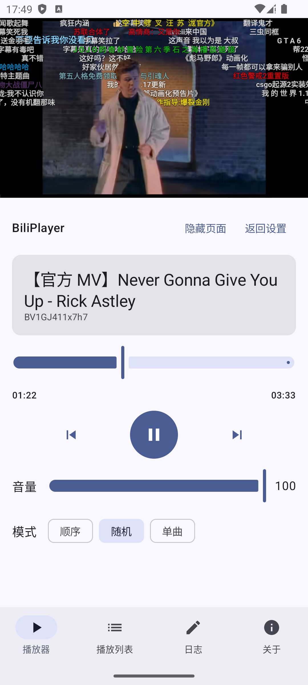
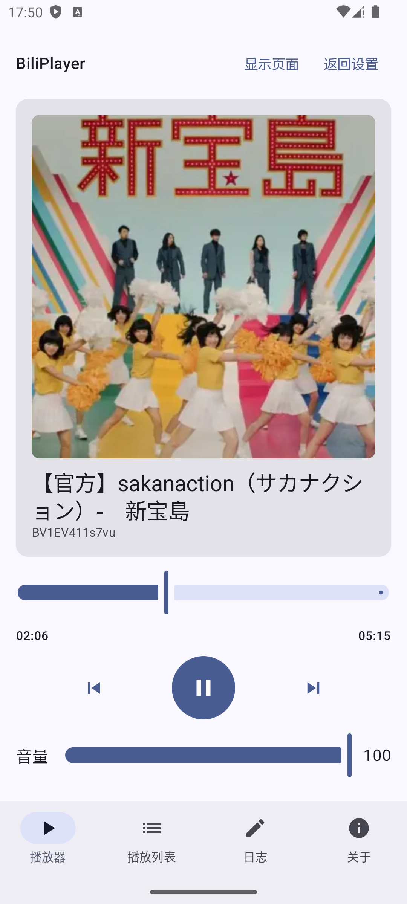
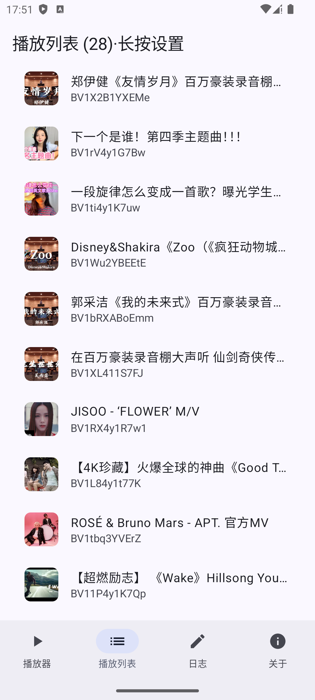
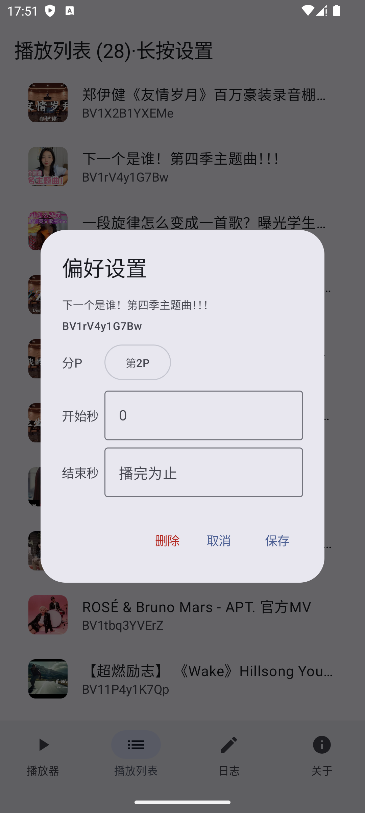
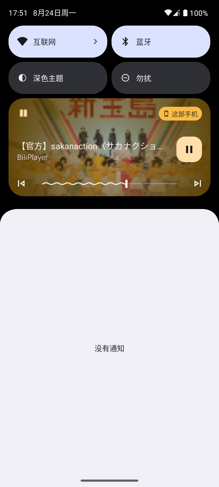

# BiliPlayer（Android）

一个用**无头浏览器**实现的 B 站（Bilibili）音乐播放器。参考桌面端项目 [Gingmzmzx/BiliPlayer](https://github.com/Gingmzmzx/BiliPlayer)（Python + Playwright）的思路，改用 **Android WebView** 作为播放引擎，在手机上实现"读取收藏夹 → 后台纯音频播放 → 系统级媒体控制"。

> 🌐 **官网 / 下载**：<https://apps.netessx.com/BiliPlayerAndroid>
> 站点上始终是最新版本，可直接下载 APK，也能查看更新内容与公告。

## 📱 截图

<table>
  <tr>
    <td align="center"><b>播放界面（带视频）</b><br></td>
    <td align="center"><b>播放界面（纯封面）</b><br></td>
  </tr>
  <tr>
    <td align="center"><b>播放列表</b><br></td>
    <td align="center"><b>修改播放设置</b><br></td>
  </tr>
  <tr>
    <td align="center"><b>系统媒体控制</b><br></td>
  </tr>
</table>

截图系统为Android Studio的avd模拟器，原生Android 14。我也在HyperOS3上进行过测试。

## ✨ 功能

- **收藏夹播放**：输入 B 站 UID 和收藏夹名称，无头浏览器自动抓取收藏夹视频列表（**纯 DOM 抓取，不调用任何 B 站 API**）。
- **后台播放**：前台服务 + 离屏 WebView，退到后台 / 锁屏也能继续播放。
- **系统媒体控制**：注册 `MediaSession`，锁屏与蓝牙耳机可控制 播放/暂停、上一曲/下一曲、拖动进度；通知栏带媒体按钮。
- **播放模式**：顺序 / 随机（无重复洗牌队列）/ 单曲循环。
- **单曲偏好**：长按播放列表项可设置 分P、开始秒、结束秒（自动截断切歌），按 `bvid` 持久化。
- **视频画面 / 看 MV**：显示 WebView 即可观看当前歌曲的视频画面（MV），边听边看；视频加载后自动网页全屏并隐藏控制条（设置页可勾选关闭自动全屏，关闭则默认显示封面）。
- **配置持久化**：UID、收藏夹名、音量、播放模式、自动全屏、单曲偏好均保存在本地。
- **WebView 显示/隐藏**：可随时切换是否显示视频画面。
- **日志 / 关于**：底部导航栏查看运行日志与应用信息。

## 🧠 原理

与桌面端一致的核心思路：**用浏览器加载视频页，播放 `<video>` 的音频**。
WebView 同时也是视频画面显示层——显示 WebView 时，用户可以看到当前歌曲的 MV/视频画面，边听边看。

| 模块 | 说明 |
|---|---|
| `HeadlessBrowser` | 离屏 WebView（不挂窗口，`KeepVisibleWebView` 保持 Chromium 认为窗口可见），桌面 UA |
| `BiliUser` | 打开 `space.bilibili.com/{uid}/favlist`，优先提取收藏夹 `fid` 直接导航，失败则真实触摸点击侧栏项，抓取 `.bili-video-card` |
| `BiliMusicPlayer` | 加载 `www.bilibili.com/video/{bvid}`，等待 `<video>`，注入 stealth + anti_pause，自动播放并轮询控制 |
| `PlayerController` | 单例状态持有者，向 UI 暴露 `StateFlow` |
| `PlayerService` | 前台服务（mediaPlayback）+ `MediaSession`，后台播放与系统媒体控制 |
| `MainActivity` | Compose 界面：设置页 + 底部导航（播放器 / 播放列表 / 日志 / 关于） |

**为什么用"真实触摸"而非 JS 点击？** `evaluateJavascript` 里的 `element.click()` 是**非可信事件**（`isTrusted=false`），B 站会忽略；而通过 `dispatchTouchEvent` 派发真实触摸，Chromium 视为可信用户手势，才能触发全屏、点击收藏夹等交互。

**为什么 WebView 要挂到窗口？** B 站页面依赖渲染（`requestAnimationFrame` / `IntersectionObserver` / 懒加载）才加载侧栏和卡片，完全离屏不渲染会导致内容抓取不到。

## 🔨 构建

环境要求：Android Studio / Gradle，JDK 17+，Android SDK Platform 37。

```bash
./gradlew assembleDebug
```

产物：`app/build/outputs/apk/debug/app-debug.apk`

`versionCode` 由构建脚本自动生成，格式为 **年 + 月 + 日 + 当日构建数**（`YYMMDDNN`），例如 `26092701` 表示 26 年 9 月 27 日的第 1 次构建。日期与计数保存在根目录 `build-stamp.properties`（已加入 `.gitignore`），跨天自动归零重新计数。

不想自己编译，可直接从官网下载：<https://apps.netessx.com/BiliPlayerAndroid>

## 📱 使用

1. 安装并打开 App，进入设置页。
2. 输入 **UID**（B 站空间地址里的数字）与 **收藏夹名称**（需为公开收藏夹），按需勾选"自动全屏并隐藏控制条"。
3. 点"开始播放"→ 无头浏览器抓取收藏夹（顶部可看到抓取过程；自动点击失败时可按提示手动点选）。
4. 抓取成功进入播放器：自动播放第一首（随机模式随机起点），后台可继续播放。
5. 底部导航切换：播放器 / 播放列表 / 日志 / 关于。
6. **播放列表**：点 = 播放；**长按** = 设置该曲的 分P / 开始秒 / 结束秒，或删除。

## ⚙️ 常见问题

- **首次抓取失败**：WebView 冷启动较慢，已通过启动预热缓解；仍失败可重试。
- **自动全屏导致误触**：主界面 WebView 已加透明触摸拦截层（抓取阶段不屏蔽，便于手动介入）。
- **后台播放被系统杀掉**：请在系统设置中允许本应用后台运行 / 加入省电白名单。

## 🔗 链接

- 官网 / 下载：<https://apps.netessx.com/BiliPlayerAndroid>
- 上游桌面版项目：[Gingmzmzx/BiliPlayer](https://github.com/Gingmzmzx/BiliPlayer)

## 📄 致谢

- 思路参考：[Gingmzmzx/BiliPlayer](https://github.com/Gingmzmzx/BiliPlayer)（Python + Playwright 桌面版）

## 📃 License

本项目采用 [Apache License 2.0](LICENSE)，同时禁止商用。
